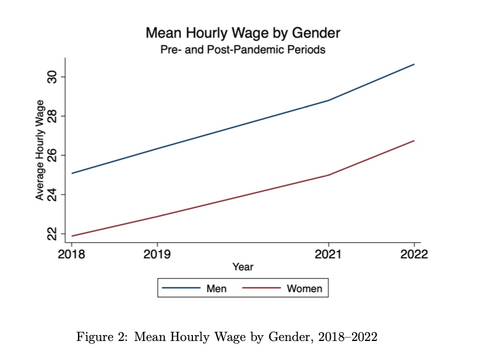

# Gender Wage Gap under COVID-19

## Overview
This project examines how the COVID-19 pandemic affected the gender wage gap in the United States. Using a difference-in-differences (DID) framework, the analysis compares wage outcomes before (2018–2019) and after (2021–2022) the pandemic.

The study focuses on prime-age, full-time workers to isolate wage differences among those who remained employed.

---

## Key Findings

- Women earn significantly lower wages than men, even after controlling for observable characteristics  
- Average wages increased after COVID-19 for both men and women  
- The gender wage gap did **not significantly change** after the pandemic  
- This suggests that structural inequalities persisted despite large economic shocks  

---

## Methodology

- Data Source: American Community Survey (ACS) via IPUMS  
- Sample: Ages 25–39, full-time workers, positive wage income  
- Model: Difference-in-Differences (DID)

Regression specification:

ln(wage) = β₀ + β₁ Female + β₂ Post + β₃ (Female × Post) + Controls + ε

- Controls include: age, education, race, occupation, industry, and state fixed effects  

---
## Visualization

This figure shows trends in average hourly wages for men and women from 2018 to 2022. While wages increased for both groups over time, the gender wage gap remained relatively stable. Regression results confirm that this change is not statistically significant.

---
## Interpretation

While the pandemic significantly disrupted labor markets, it did not alter the relative wage gap between men and women among employed workers.

The increase in average wages may reflect:
- labor market recovery
- inflationary pressure
- compositional effects (exit of lower-wage workers)

---

## Limitations

- Focuses only on employed individuals (selection bias)
- Does not capture labor force exit
- Short-term analysis (long-term effects unknown)

---
## Conclusion

This analysis finds that, among individuals who remained in the labor force, the gender wage gap did not significantly change after COVID-19.

However, this result may mask important inequalities. Women were more likely to work in service-sector jobs that were heavily affected by layoffs during the pandemic. In addition, increased childcare responsibilities during remote work disproportionately affected women.

These factors suggest that the true burden of the pandemic on gender inequality may not be fully captured by wage data alone. Future research should examine labor force participation and unpaid labor to better understand these “invisible” dimensions of inequality.

---
## Tools Used

- Stata 

---

## Author

Risa Kuriyama  
UC San Diego | Economics  
Interested in social epidemiology and data analysis

---
## Full Paper

You can view the full analysis here:

[Download the full paper](gender_wage_gap_covid_analysis.pdf)

---
# COVID-19による男女賃金格差の変化

## 概要
本プロジェクトでは、COVID-19が米国における男女賃金格差に与えた影響を分析した。差の差分法（DID）を用い、パンデミック前（2018–2019）と後（2021–2022）の賃金を比較した。

---

## 主な結果

- 女性は男性より有意に低い賃金を得ている  
- パンデミック後、男女ともに平均賃金は上昇  
- 男女賃金格差は統計的に有意な変化なし  
- 構造的な不平等は短期的ショックでは変わりにくい  

---

## 手法

- データ：ACS（IPUMS）  
- 対象：25〜39歳、フルタイム労働者  
- モデル：差の差分法（DID）

---
## 可視化

この図は、2018年から2022年にかけた男女の平均時給の推移を示している。パンデミック後、男女ともに賃金は上昇しているものの、男女間の賃金格差は大きく変化していないことがわかる。回帰分析の結果も、この変化が統計的に有意ではないことを示している。

---
## 結論

本分析では、労働市場に残っているフルタイム労働者に限定した場合、COVID-19後も男女賃金格差に統計的に有意な変化は見られなかった。

しかし、この結果は重要な不平等を見えにくくしている可能性がある。女性はサービス業などパンデミックの影響を強く受けた産業に多く従事しており、解雇や雇用喪失の影響をより受けやすかった。また、リモートワークの拡大に伴い、育児など家庭内の負担も女性に偏る傾向があった。

このように、賃金データのみでは捉えきれない「見えない不平等」が存在する可能性がある。今後は、労働参加や無償労働といった側面も含めた分析が必要である。

---

## ツール

- Stata  

---
## 論文全文

分析の詳細はこちらからご覧いただけます：

[論文をダウンロード](gender_wage_gap_covid_analysis.pdf)
